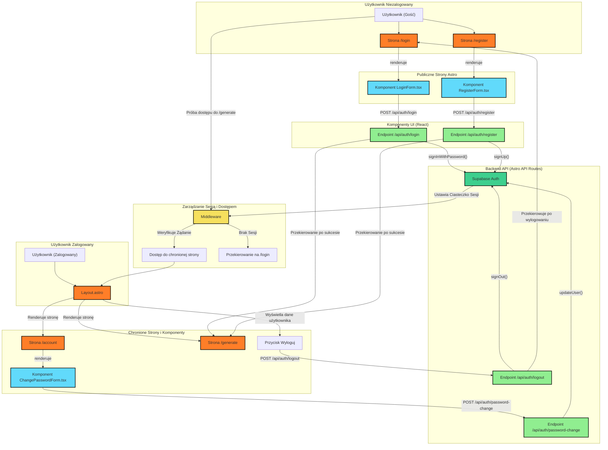

# Mermaid Diagram - UI Components

Jesteś doświadczonym architektem oprogramowania, którego zadaniem jest utworzenie diagramu Mermaid w celu wizualizacji architektury stron Astro i komponentów React dla modułu logowania i rejestracji. Diagram powinien zostać utworzony w następującym pliku: DESTINATION

Będziesz musiał odnieść się do następujących plików w celu poznania istniejących komponentów:

<file_references>
[prd.md](mdc:.ai/prd.md)
</file_references>

<destination>
.ai/diagrams/ui.md
</destination>

Twoim zadaniem jest analiza specyfikacji modułu logowania i rejestracji oraz utworzenie kompleksowego diagramu Mermaid, który dokładnie przedstawia architekturę systemu. Diagram powinien być w języku polskim.

Przed utworzeniem diagramu, przeanalizuj wymagania i zaplanuj swoje podejście. Umieść swoją analizę wewnątrz tagów <architecture_analysis>. W tej analizie:

1. Wypisz wszystkie komponenty wymienione w plikach referencyjnych.
2. Zidentyfikuj główne strony i ich odpowiadające komponenty.
3. Określ przepływ danych między komponentami.
4. Dostarcz krótki opis funkcjonalności każdego komponentu.

Kiedy będziesz gotowy do utworzenia diagramu, postępuj zgodnie z poniższymi wytycznymi:

1. Rozpocznij diagram od następującej składni:

   ```mermaid
   flowchart TD
   ```

2. Uwzględnij następujące elementy w swoim diagramie:

   - Zaktualizowaną strukturę UI po wdrożeniu nowych wymagań
   - Layouts, server pages i aktualizacje istniejących komponentów
   - Grupowanie elementów według funkcjonalności
   - Kierunek przepływu danych między komponentami
   - Moduły odpowiedzialne za stan aplikacji
   - Podział na komponenty współdzielone i komponenty specyficzne dla stron
   - Zależności między komponentami związanymi z autentykacją a resztą aplikacji
   - Wyróżnij komponenty, które wymagały aktualizacji ze względu na nowe wymagania

3. Przestrzegaj tych zasad składni Mermaid:

   - Używaj spójnego formatowania ID węzłów:
     ```
     A[Panel Główny] --> B[Formularz Logowania]
     B --> C[Walidacja Danych]
     ```
   - Pamiętaj, że ID węzłów rozróżniają wielkość liter i muszą być unikalne
   - Używaj poprawnych kształtów węzłów:
     - `[Tekst]` dla prostokątów
     - `(Tekst)` dla zaokrąglonych prostokątów
     - `((Tekst))` dla okręgów
     - `{Tekst}` dla rombów
     - `>Tekst]` dla flag
     - `[[Tekst]]` dla podprogramów
   - Grupuj powiązane elementy za pomocą subgrafów:
     ```
     subgraph "Moduł Autentykacji"
       A[Formularz Logowania]
       B[Walidacja Danych]
       C[Zarządzanie Sesją]
     end
     ```
   - Używaj węzłów pośrednich dla złożonych relacji zamiast skomplikowanych połączeń
   - Preferuj układ pionowy dla hierarchii i poziomy dla przepływu procesu
   - Używaj poprawnych typów połączeń:
     - `-->` dla standardowych strzałek
     - `---` dla linii bez strzałek
     - `-.->` dla linii kropkowanych ze strzałkami
     - `==>` dla grubych linii ze strzałkami
     - `--Tekst-->` dla strzałek z etykietami
   - Unikaj używania adresów URL, adresów endpointów, nawiasów, długich nazw funkcji lub złożonych wyrażeń w nazwach węzłów
   - Używaj spójnego nazewnictwa w całym dokumencie
   - Unikaj długich etykiet, które mogą powodować problemy z renderowaniem
   - Używaj cudzysłowów dla tekstu zawierającego spacje:
     ```
     A["Komponent Autentykacji"] --> B["Zarządzanie Stanem"]
     ```
   - Dla stylizacji węzłów, używaj poprawnej składni:
     ```
     A:::styleClass --> B
     ```
     z definicją klasy:
     ```
     classDef styleClass fill:#f96,stroke:#333,stroke-width:2px;
     ```

4. Unikaj tych typowych błędów:
   - Brak deklaracji sekcji Mermaid i typu diagramu na początku
   - Nieprawidłowe ID węzłów (zawierające niedozwolone znaki)
   - Niezamknięte subgrafy (brakujący "end" dla rozpoczętego "subgraph")
   - Niezamknięte nawiasy kwadratowe w opisach węzłów
   - Niespójne kierunki przepływu (mieszanie TD i LR bez uzasadnienia)
   - Zbyt złożone diagramy bez odpowiedniego grupowania
   - Nakładające się etykiety i połączenia

Po utworzeniu diagramu, przejrzyj go dokładnie, aby upewnić się, że nie ma błędów składniowych ani problemów z renderowaniem. Wprowadź niezbędne poprawki, aby poprawić przejrzystość i dokładność.

Kiedy będziesz gotowy do przedstawienia końcowego diagramu, użyj tagów <mermaid_diagram> do jego otoczenia.

<architecture_analysis>
1.  **Wypisane Komponenty:**
    *   **Strony (Astro):** `/login`, `/register`, `/account`, `/generate`.
    *   **Komponenty (React):** `LoginForm.tsx`, `RegisterForm.tsx`, `ChangePasswordForm.tsx`.
    *   **Layouty (Astro):** `Layout.astro`.
    *   **API Endpoints:** `POST /api/auth/login`, `POST /api/auth/register`, `POST /api/auth/logout`, `POST /api/auth/password-change`.
    *   **Logika Pośrednicząca (Middleware):** `src/middleware/index.ts`.
    *   **Usługi:** Klient Supabase.

2.  **Główne Strony i Komponenty:**
    *   Strona `/login` renderuje komponent `LoginForm.tsx`.
    *   Strona `/register` renderuje komponent `RegisterForm.tsx`.
    *   Strona `/account` (chroniona) renderuje `ChangePasswordForm.tsx`.
    *   `Layout.astro` jest głównym layoutem aplikacji, wyświetlającym stan zalogowania (email użytkownika i przycisk wylogowania) lub link do logowania.

3.  **Przepływ Danych:**
    *   Formularze (`LoginForm`, `RegisterForm`) wysyłają żądania POST do odpowiednich endpointów API.
    *   Endpointy API (`/api/auth/*`) komunikują się z Supabase Auth w celu weryfikacji/utworzenia użytkownika.
    *   Supabase zarządza sesją za pomocą ciasteczek (cookies).
    *   `Middleware` przechwytuje żądania do chronionych stron (`/generate`, `/account`), weryfikuje sesję z Supabase i w razie braku autoryzacji przekierowuje na `/login`.
    *   `Layout.astro` odczytuje dane o zalogowanym użytkowniku z `Astro.locals` (dostarczone przez middleware) i dynamicznie renderuje interfejs.

4.  **Opis Funkcjonalności:**
    *   `LoginForm.tsx`: Renderuje formularz logowania, waliduje dane i komunikuje się z API w celu zalogowania użytkownika.
    *   `RegisterForm.tsx`: Renderuje formularz rejestracji, waliduje dane (w tym zgodność haseł) i komunikuje się z API w celu utworzenia konta.
    *   `ChangePasswordForm.tsx`: Renderuje formularz zmiany hasła dla zalogowanego użytkownika.
    *   `/api/auth/*`: Zestaw endpointów backendowych obsługujących logikę autentykacji (logowanie, rejestracja, wylogowanie, zmiana hasła).
    *   `middleware`: Chroni trasy aplikacji, sprawdzając, czy użytkownik jest zalogowany.
</architecture_analysis>

<mermaid_diagram>

</mermaid_diagram> 